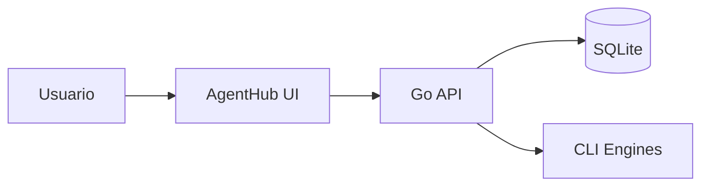
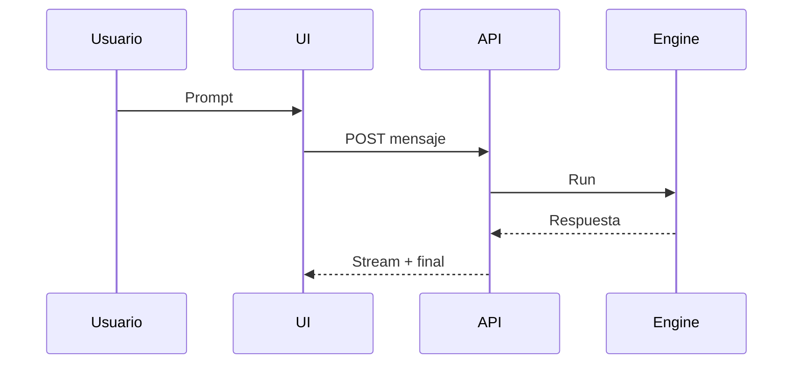
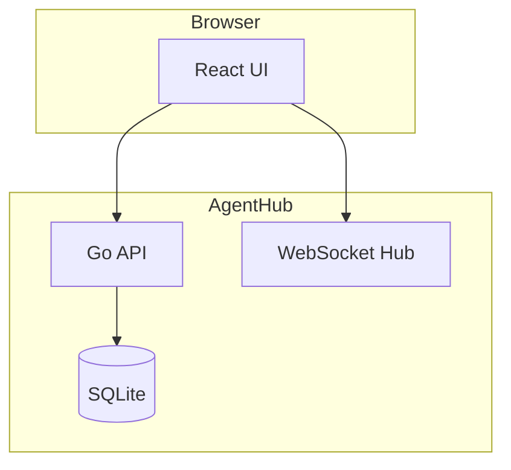
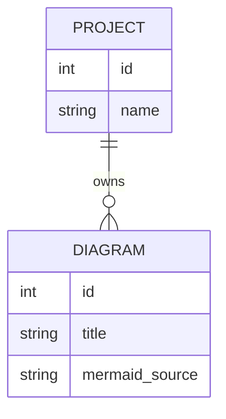
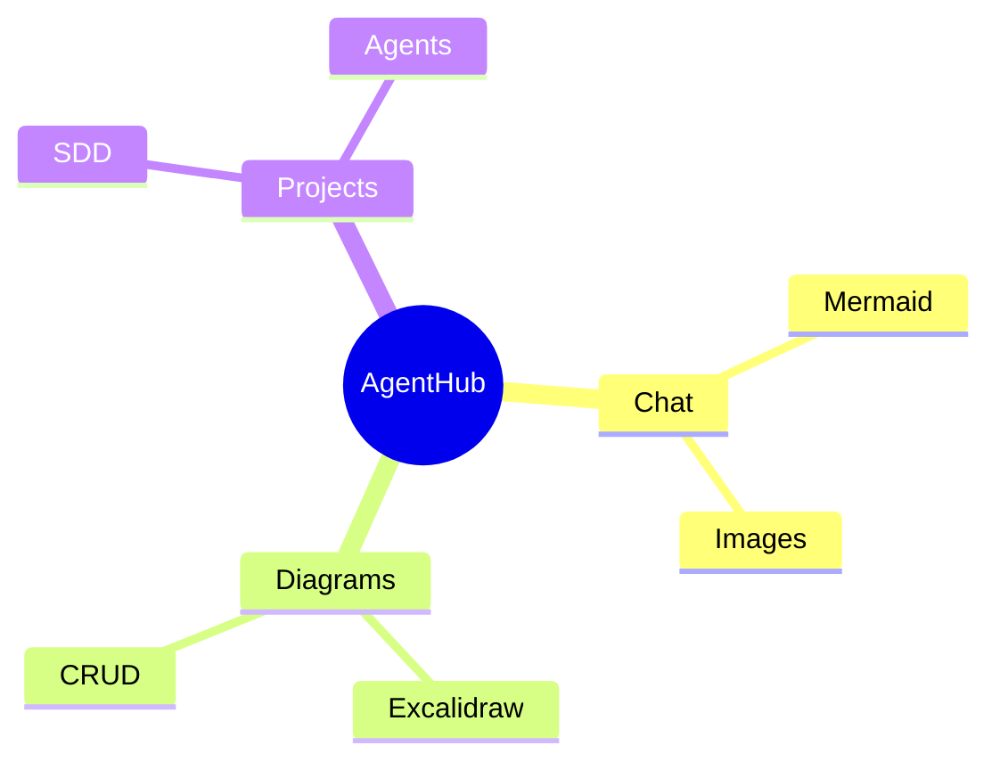

## Cuándo usar

- El usuario pide un esquema, diagrama, arquitectura, flujo, secuencia, ERD, C4 o mind-map.
- AgentHub `/api/diagrams/generate` necesita Mermaid como formato intermedio para Excalidraw.
- Un chat necesita devolver un bloque `mermaid` renderizable inline.

## Cuándo NO usar

- El usuario pide una imagen fotorealista, logo, mockup visual o arte raster.
- El usuario necesita código ejecutable, no una representación visual.
- El dominio es ambiguo y elegir un tipo puede cambiar el significado; pedí una aclaración breve.

## Selección de tipo

| Señal del prompt | Tipo Mermaid | Usar cuando |
| --- | --- | --- |
| "flujo", "pipeline", pasos, estados | `flowchart` | Procesos, sistemas, dependencias generales |
| "cuando A llama a B", APIs, eventos temporales | `sequenceDiagram` | Interacciones en orden temporal |
| "arquitectura", containers, servicios, boundaries | `flowchart` estilo C4 | C4 v1 simple usando subgraphs |
| Entidades, tablas, relaciones, cardinalidad | `erDiagram` | Modelado de datos |
| Ideas, categorías, brainstorming | `mindmap` | Taxonomías o exploración conceptual |

## Reglas críticas de output

1. Respondé **solo Mermaid válido**, sin explicación, sin markdown fences y sin texto alrededor.
2. Máximo 25 nodos visibles; legibilidad antes que exhaustividad.
3. Labels cortos: 2–5 palabras, sin párrafos dentro de nodos.
4. Preferí IDs simples ASCII (`UI`, `API`, `DB`) y labels entre corchetes cuando haga falta.
5. No uses sintaxis experimental si Mermaid estable puede resolverlo.
6. Si el tipo no se puede decidir sin inventar, pedí una sola aclaración en vez de generar.
7. Para C4, usá `flowchart TB/LR` con `subgraph` para boundaries; no dependas de extensiones C4 no garantizadas.
8. Para errores o limitaciones, devolvé una aclaración corta; no mezcles aclaración y Mermaid.

## Ejemplos

### Flowchart

### Sequence

### C4 simple

### ERD

### Mindmap

## Manejo de errores

- Si falta contexto esencial: `Necesito una aclaración: ¿querés flowchart, sequence, C4, ERD o mindmap?`
- Si el prompt pide demasiados nodos: generá una versión resumida con los componentes principales.
- Si Mermaid no soporta el detalle pedido: representá la intención con el tipo estable más cercano.
