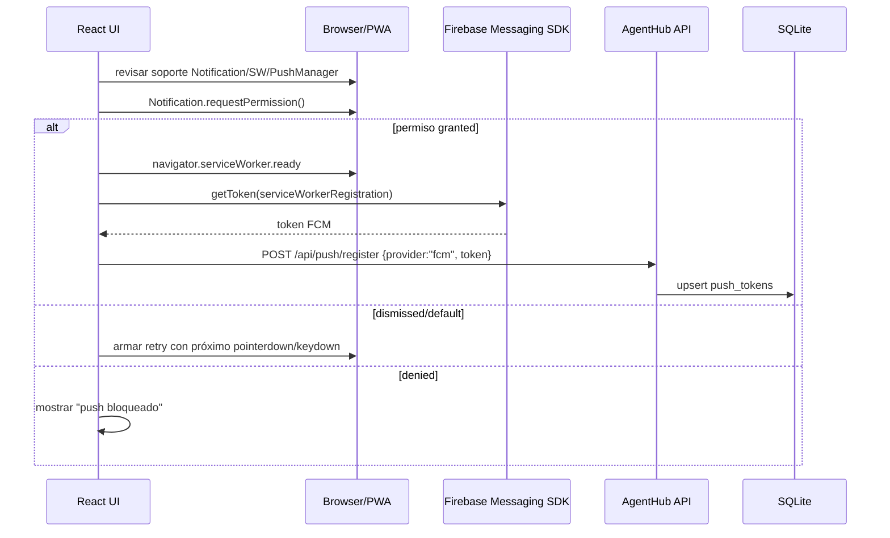

# PWA, FCM push y updates de UI

Última actualización: 2026-04-29 · AgentHub v0.2.48

Este documento deja explícito cómo funciona la PWA mobile/web de AgentHub: instalación, service worker, Firebase Cloud Messaging, permisos de notificación y detección de nuevas versiones de UI.

---

## Objetivo

AgentHub tiene una sola UI React/Vite servida por el daemon Go. Esa UI puede usarse como:

- pestaña normal en `https://agenthub.kyn3d.com`
- PWA instalada en mobile/desktop
- superficie web local por LAN cuando aplique

La PWA debe:

1. poder instalarse desde Chrome/Android;
2. pedir permisos de notificación sin obligar a buscar un botón escondido;
3. registrar tokens FCM y guardarlos en AgentHub;
4. recibir push FCM aun cuando la app no esté en foreground;
5. avisar cuando hay una UI nueva y ofrecer recarga;
6. evitar que Cloudflare o el navegador dejen pegado un `sw.js` viejo.

---

## Archivos relevantes

| Archivo | Responsabilidad |
| --- | --- |
| `frontend/public/manifest.webmanifest` | Metadata de instalación PWA. |
| `frontend/public/sw.js` | Service worker: lifecycle, push, notification click. |
| `frontend/src/pwa.ts` | Registro del service worker con query de versión. |
| `frontend/src/lib/firebasePush.ts` | Config Firebase Web App, soporte browser, permiso y token FCM. |
| `frontend/src/lib/notifications.tsx` | Drawer/toasts, prompt push, aviso de update UI. |
| `frontend/src/lib/uiUpdateWatcher.ts` | Watcher que compara bundles publicados vs cargados. |
| `internal/server/push.go` | Registro de tokens y envío FCM HTTP v1. |
| `internal/store/push.go` | Repo SQLite de `push_tokens`. |
| `internal/store/migrations/0016_push_tokens.sql` | Tabla `push_tokens`. |
| `internal/server/server.go` | Headers de caché para SPA/PWA (`sw.js`, manifest, assets). |
| `internal/config/config.go` | Config FCM/env vars. |

---

## Firebase / FCM

### Proyecto usado

AgentHub usa el proyecto Firebase **RelogTemperatura**:

```txt
projectId: relogtemperatura
projectNumber: 100530365913
web app id: 1:100530365913:web:096380327c9c7151e265c8
```

La Web App config pública vive en `frontend/src/lib/firebasePush.ts`. La `apiKey` de Firebase Web no es un secreto; identifica el proyecto para el SDK client-side.

### Autenticación server-side

El backend manda FCM por HTTP v1 usando el login local de Firebase CLI:

```txt
Firebase CLI: /home/nestor/.npm-global/bin/firebase
CLI cache:    /home/nestor/.config/configstore/firebase-tools.json
```

Reglas de seguridad:

- nunca imprimir el access token ni el refresh token;
- no commitear `firebase-tools.json`;
- si el access token expiró, `internal/server/push.go` ejecuta `firebase projects:list --json` para refrescar el cache del CLI y vuelve a leerlo;
- a futuro se puede reemplazar por service account sin cambiar el contrato UI/DB.

### Env vars FCM

| Variable | Default | Uso |
| --- | --- | --- |
| `AGENTHUB_FCM_ENABLED` | `true` | Habilita envío FCM server-side. |
| `AGENTHUB_FCM_PROJECT_ID` | `relogtemperatura` | Proyecto destino de FCM HTTP v1. |
| `AGENTHUB_PUBLIC_URL` | `https://agenthub.kyn3d.com` | Base pública para links en notificaciones. |
| `AGENTHUB_FIREBASE_CLI` | `/home/nestor/.npm-global/bin/firebase` | Binario CLI usado para refrescar OAuth. |
| `AGENTHUB_FIREBASE_TOOLS_CONFIG` | `/home/nestor/.config/configstore/firebase-tools.json` | Cache OAuth del Firebase CLI. |

---

## Flujo de registro de push



### UX de permiso

Browser vendors pueden bloquear `Notification.requestPermission()` si no viene de un gesto humano. Por eso el flujo actual hace dos cosas:

1. intenta pedir permiso automáticamente al abrir;
2. si el browser devuelve `default`/no muestra prompt, arma un retry invisible para el próximo tap/tecla.

Estados visibles en el drawer:

| Estado | Significado |
| --- | --- |
| `pidiendo permiso` | La UI está esperando respuesta del navegador. |
| `push activo` | Token FCM registrado en backend. |
| `push bloqueado` | El sitio tiene notificaciones denegadas en Chrome/Android. Hay que desbloquear desde settings del sitio. |
| `push no disponible` | Contexto sin soporte: no HTTPS, sin service worker, sin PushManager o Firebase Messaging no soportado. |
| `permitir push` | El browser no mostró prompt; el próximo gesto reintenta. |
| `reintentar push` | Firebase no devolvió token o hubo error transitorio. |

El botón solo se deshabilita cuando está `pidiendo permiso` o cuando ya está `push activo`.

---

## Envío de notificaciones FCM

Cualquier notificación in-app pasa por `broadcastNotification` en `internal/server/notifications.go`.

Flujo:

1. se emite por WebSocket al frontend;
2. en paralelo `sendPushNotification` busca tokens activos `provider='fcm'`;
3. obtiene access token OAuth del Firebase CLI cache;
4. manda HTTP v1 a:

```txt
https://fcm.googleapis.com/v1/projects/relogtemperatura/messages:send
```

El payload incluye:

- `notification.title/body`
- `data.kind/severity/title/body/link`
- `webpush.notification.icon/badge`
- `webpush.fcm_options.link`

Si FCM responde `UNREGISTERED` o `INVALID_ARGUMENT`, el token se marca con `disabled_at` para no reintentarlo indefinidamente.

### Endpoint de prueba

Con sesión web autenticada:

```http
POST /api/push/test
```

Esto genera una notificación local y dispara el envío FCM a los tokens registrados.

---

## Service worker

### Registro

`frontend/src/pwa.ts` registra el service worker con query de versión:

```ts
navigator.serviceWorker.register("/sw.js?v=0.2.48")
```

Motivo: Cloudflare llegó a servir un `sw.js` viejo desde cache. La query de versión cambia la cache key y fuerza update aunque el edge tenga una copia anterior de `/sw.js`.

### Headers de caché

`internal/server/server.go` sirve:

| Ruta | Cache-Control |
| --- | --- |
| `/` y `/index.html` | `no-store` |
| `/sw.js` | `no-store` + `Service-Worker-Allowed: /` |
| `/manifest.webmanifest` | `no-store` |
| `/assets/*` | `public, max-age=31536000, immutable` |
| otros estáticos | `public, max-age=3600` |

`/assets/*` puede ser immutable porque Vite genera nombres con hash. `index.html` y `sw.js` no pueden ser cacheados agresivamente porque son los puntos de entrada que descubren versiones nuevas.

### Push events

`frontend/public/sw.js` escucha:

- `push`: parsea payload FCM/Web Push y muestra `registration.showNotification(...)`.
- `notificationclick`: enfoca una ventana existente o abre una nueva en el link enviado.

---

## Watcher de updates de UI

La PWA ya abierta no cambia de JS automáticamente. El bundle cargado vive en memoria hasta recarga. Para resolverlo, `frontend/src/lib/uiUpdateWatcher.ts` detecta si el `index.html` publicado apunta a bundles distintos.

### Algoritmo

1. Al iniciar, calcula una firma con todos los assets de la página actual:
   - `script[type="module"][src]`
   - `link[rel="stylesheet"][href]`
   - solo rutas `/assets/*`
2. Cada 60s, y también en `focus`, `online` o `visibilitychange=visible`, pide:

```txt
/?__agenthub_ui_update=<timestamp>
```

3. Parsea el HTML con `DOMParser`.
4. Calcula la firma publicada.
5. Si la firma publicada difiere de la cargada, dispara una notificación local:

```txt
UI nueva disponible
Hay una versión nueva de AgentHub. Recargá para verla.
```

El toast trae botones:

- `recargar` → `window.location.reload()`
- `después` → descarta el toast

También queda en el drawer; tocar esa notificación recarga la página.

### Por qué comparar assets y no solo `VERSION`

El sidebar desktop ya compara `GET /healthz.version` contra `__APP_VERSION__`, pero eso no alcanza para mobile/PWA porque:

- el sidebar desktop no siempre está visible en mobile;
- un cambio frontend-only puede publicar bundles nuevos aunque el proceso backend aún no haya reiniciado;
- lo que importa para la UI cargada es si `index.html` apunta a otro bundle.

Por eso el watcher compara directamente hashes de Vite.

---

## Operación y validación

### Build frontend

```bash
cd /home/nestor/agenthub/frontend
pnpm run build
```

### Validación backend si se tocó Go o se quiere sincronizar versión runtime

```bash
cd /home/nestor/agenthub
go test ./...
```

### Smoke backend seguro

Usar siempre DB temporal y WhatsApp apagado:

```bash
cd /home/nestor/agenthub

go build -tags 'sqlite_fts5 sqlite_json' \
  -ldflags "-X github.com/snestors/agenteshub/internal/buildinfo.Version=$(cat VERSION) -X github.com/snestors/agenteshub/internal/buildinfo.GitCommit=$(git rev-parse --short HEAD)" \
  -o bin/agenthub.next ./cmd/agenthub

SMOKE_DB="/tmp/agenthub-smoke-$$.db"
AGENTHUB_HTTP_ADDR="127.0.0.1:8094" \
AGENTHUB_DB_PATH="$SMOKE_DB" \
AGENTHUB_WA_ENABLED=false \
AGENTHUB_DEV=true \
./bin/agenthub.next serve > /tmp/agenthub-smoke.log 2>&1 &
SMOKE_PID=$!

curl -sf http://127.0.0.1:8094/healthz
curl -sD - -o /dev/null "http://127.0.0.1:8094/sw.js?v=$(cat VERSION)"

kill $SMOKE_PID
rm -f "$SMOKE_DB"*
```

El header esperado para `sw.js` es:

```txt
Cache-Control: no-store
Service-Worker-Allowed: /
```

### Promote

```bash
mv bin/agenthub.next bin/agenthub
bin/safe-restart.sh
```

`safe-restart` agenda el reinicio y espera a que no haya turns activos.

---

## Troubleshooting

### No aparece el prompt de permiso

Posibles causas:

- Chrome exige gesto humano: tocar cualquier parte debería reintentar.
- El sitio ya está bloqueado: revisar settings del sitio en Chrome → Notifications.
- No estás en HTTPS: Web Push requiere secure context. Usar `https://agenthub.kyn3d.com`.

### Botón muestra `push no disponible`

Revisar desde DevTools/console:

```js
window.isSecureContext
"Notification" in window
"serviceWorker" in navigator
"PushManager" in window
Notification.permission
```

### No llega FCM pero el token está registrado

Revisar logs del daemon por `fcm auth` o `fcm send`. Errores típicos:

- `UNREGISTERED`: token viejo, se deshabilita solo.
- `INVALID_ARGUMENT`: token inválido o payload inválido.
- OAuth expirado sin refresh: revisar Firebase CLI login.

### Sigue cargando UI vieja

1. Abrir `https://agenthub.kyn3d.com/sw.js?v=<VERSION>` y verificar que el contenido tenga la versión actual.
2. Confirmar headers:

```bash
curl -sD - -o /dev/null "https://agenthub.kyn3d.com/sw.js?v=$(cat VERSION)"
```

3. Si el navegador tiene una PWA vieja viva en memoria, cerrar completamente la PWA y abrir de nuevo.
4. Si Cloudflare cachea algo inesperado, subir query versionada o purgar cache puntual.

---

## Decisiones tomadas

- FCM usa proyecto existente `relogtemperatura` para no crear otro proyecto cloud.
- El backend usa Firebase CLI login cache por simplicidad personal; no service account todavía.
- `sw.js` y manifest no se cachean; assets hasheados sí.
- La UI update detection se basa en hashes reales de bundles, no solo en número de versión.
- El primer release con watcher necesita una recarga manual inicial; después la PWA avisa sola.
